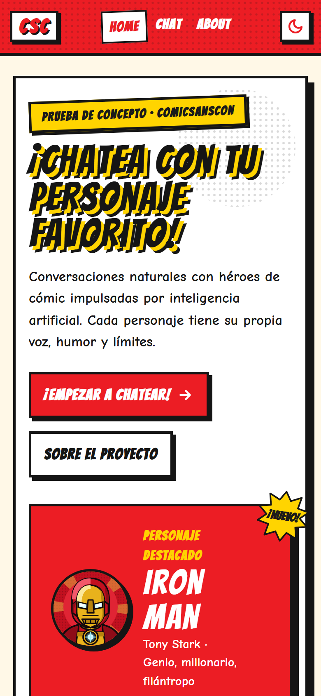
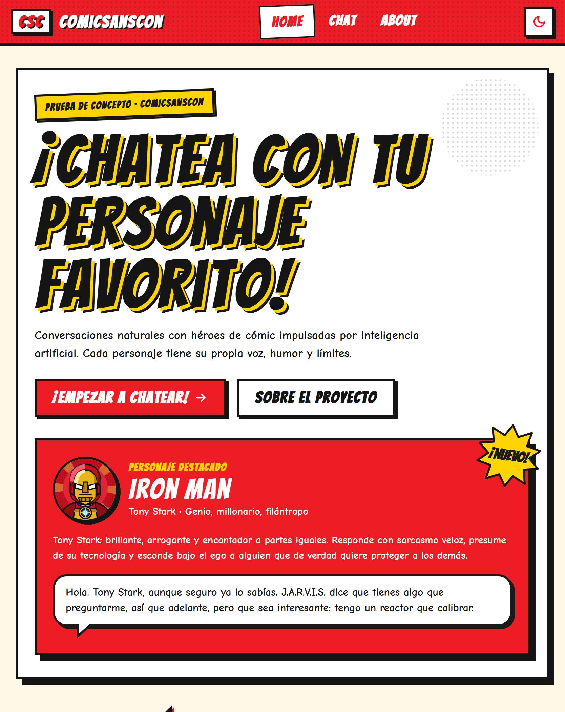
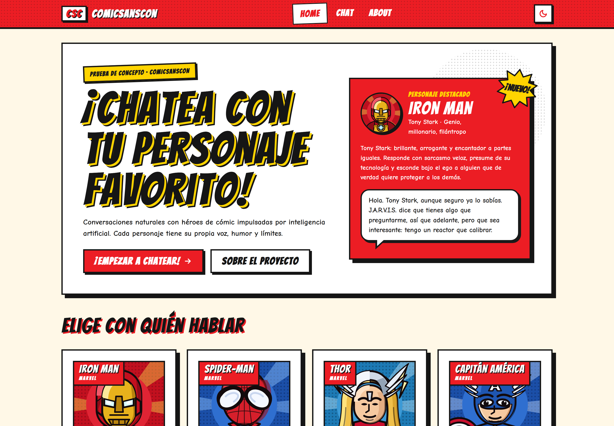
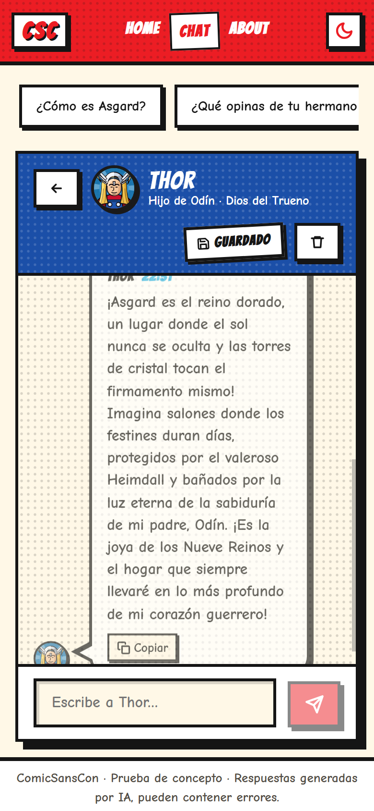
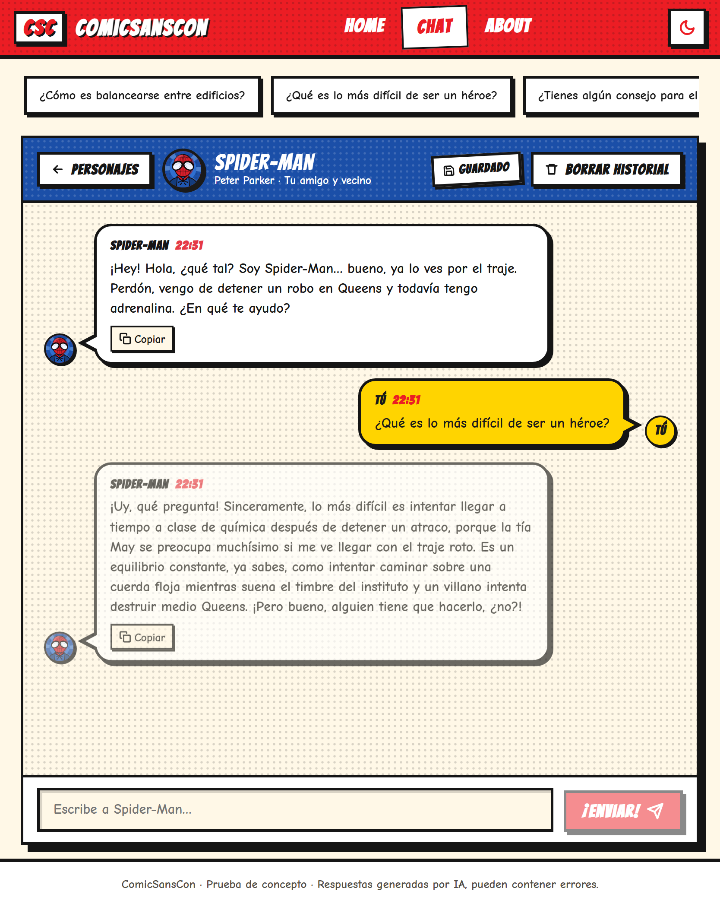
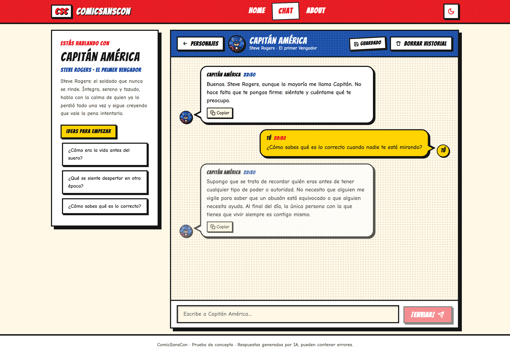
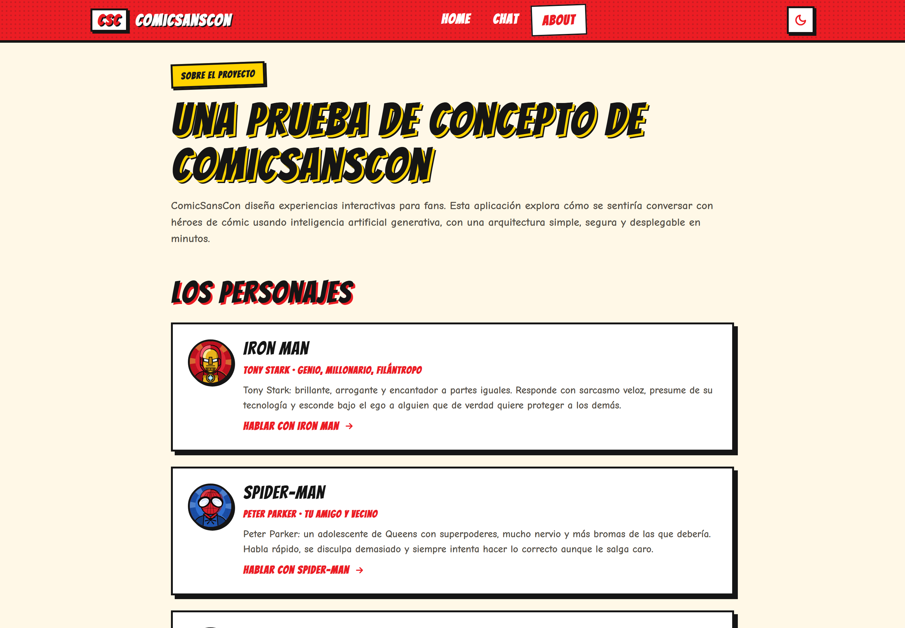

# ComicSansCon · Chatea con tu personaje favorito

Aplicación web de una sola página (SPA) donde cualquier persona puede mantener una conversación natural con un personaje de cómic, escrita por **Google Gemini** y servida de forma segura a través de una **Vercel Serverless Function**.

🔗 **Aplicación desplegada:** https://comicsanscon-chat.vercel.app

📦 **Repositorio:** https://github.com/rominababiel/comicsanscon-chat

---

## Índice

1. [Contexto y problema](#contexto-y-problema)
2. [Objetivos](#objetivos)
3. [Alcance de la solución](#alcance-de-la-solución)
4. [Casos de uso](#casos-de-uso)
5. [Los personajes](#los-personajes)
6. [Funcionalidades](#funcionalidades)
7. [Arquitectura](#arquitectura)
8. [Requisitos](#requisitos)
9. [Ejecución local](#ejecución-local)
10. [Tests](#tests)
11. [Despliegue en Vercel](#despliegue-en-vercel)
12. [Capturas de pantalla](#capturas-de-pantalla)
13. [Registro del uso de IA](#registro-del-uso-de-ia)

---

## Contexto y problema

ComicSansCon es una agencia digital que produce experiencias interactivas para fans de videojuegos, películas y series. Su equipo de producto quiere explorar una línea de negocio nueva: **personajes de ficción con los que el público pueda hablar**, en lugar de las fichas estáticas y los quizzes que ofrece hoy.

Antes de comprometer presupuesto necesitan responder tres preguntas, y ninguna se contesta con un documento:

- ¿Una conversación con un personaje **se siente realmente como ese personaje**, o la IA acaba sonando a asistente genérico?
- ¿Se puede integrar un modelo de lenguaje **sin exponer la clave de API**, que es un coste facturable y un riesgo de seguridad?
- ¿Cuánto trabajo cuesta tener algo **usable en el móvil de un stakeholder** durante una reunión?

Este repositorio es la prueba de concepto que responde a esas preguntas con una aplicación funcional y desplegada, no con una maqueta.

## Objetivos

1. **Validar la ilusión del personaje.** Que la conversación mantenga la voz, el humor y los límites de cada héroe durante varios turnos, y que el personaje recuerde lo que se habló antes.
2. **Integrar la IA de forma segura.** Que la clave de Gemini viva solo en el servidor y que el navegador nunca pueda leerla ni usarla por su cuenta.
3. **Demostrar una experiencia fluida.** Respuestas que empiecen a aparecer en pocos segundos, con estados visibles de carga y de error cuando algo falla.
4. **Ser mostrable en cualquier pantalla.** Diseño mobile-first que funcione igual en un teléfono, una tablet y un portátil.
5. **Entregar algo mantenible.** Código organizado en módulos, con tests automáticos y documentación suficiente para que otra persona lo levante sin ayuda.

## Alcance de la solución

**Lo que la aplicación hace**

- Galería con cuatro personajes de Marvel, cada uno con su propia personalidad definida por un *system prompt* distinto.
- Chat en tiempo real con el personaje elegido, con el historial completo enviado a la IA en cada mensaje para que no pierda el contexto.
- Persistencia de cada conversación en el navegador, de modo que se pueda cerrar la pestaña y retomar la charla después.
- Navegación entre tres vistas (Home, Chat, About) sin recargar la página, con URLs reales que se pueden compartir.

**Lo que queda fuera, por ser una prueba de concepto**

- No hay cuentas de usuario: las conversaciones viven en el navegador de cada persona, no en una base de datos.
- No hay panel de administración: añadir un personaje significa añadir su ficha y su prompt al código.
- No hay moderación automática más allá de los filtros de la propia API y de las reglas del prompt.
- No hay voz, imágenes ni generación de contenido más allá del texto de la conversación.

## Casos de uso

| # | Quién | Qué quiere hacer | Cómo lo resuelve la aplicación |
| --- | --- | --- | --- |
| 1 | Una fan | Hablar con su héroe favorito y que suene como él | Entra en Home, elige el personaje en la galería y escribe. El *system prompt* fija personalidad, tono, conocimiento y límites, y la respuesta aparece palabra a palabra. |
| 2 | Una fan | Retomar una charla que dejó a medias | Al volver a la aplicación, la conversación de ese personaje sigue donde la dejó; un indicador avisa de que hay historial guardado y un botón permite borrarlo. |
| 3 | Una persona curiosa | Probar varios personajes y comparar cómo responden | Cada personaje tiene su propia conversación independiente; cambiar de uno a otro no mezcla ni borra los historiales. |
| 4 | El equipo de producto | Enseñar la demo a un stakeholder desde el móvil | La interfaz es mobile-first y la URL de cada vista es compartible: se puede enviar un enlace directo a la conversación con un personaje concreto. |
| 5 | Una persona con mala conexión | Entender qué pasa cuando algo falla | La aplicación distingue carga, error de red y error de la IA, explica el problema en lenguaje claro y ofrece reintentar sin perder el mensaje escrito. |
| 6 | El equipo técnico | Evaluar el coste y el riesgo antes de ampliar | La clave vive en una variable de entorno del servidor; el navegador solo envía un identificador de personaje y nunca ve el prompt ni la clave. |

## Los personajes

La aplicación incluye una galería con cuatro héroes de **Marvel**, cada uno con su propio **system prompt** que define personalidad, tono, conocimiento y limitaciones. El personaje principal es **Iron Man**. Los retratos son ilustraciones vectoriales propias en estilo cómic ([`public/characters/`](public/characters/)); no se usa arte oficial.

| Personaje | Quién es | Personalidad |
| --- | --- | --- |
| **Iron Man** | Tony Stark · genio, millonario, filántropo | Sarcasmo veloz, ego enorme y un fondo protector. Habla con J.A.R.V.I.S., presume de su armadura y baja el tono un instante cuando algo importa. |
| **Spider-Man** | Peter Parker · tu amigo y vecino | Adolescente nervioso, bromista y profundamente bueno. Se disculpa de más, admira al señor Stark y nunca revela su identidad a desconocidos. |
| **Thor** | Hijo de Odín · Dios del Trueno | Grandilocuente, noble y algo ingenuo con Midgard. Habla de batallas y honor, y se asombra con el café y los ascensores. |
| **Capitán América** | Steve Rogers · El primer Vengador | Íntegro, sereno y tozudo. Habla con calma, es algo anticuado y cree que siempre vale la pena intentar hacer lo correcto. |

Cada prompt (en [`api/_lib/prompts.js`](api/_lib/prompts.js), solo en el servidor) tiene cinco bloques: **identidad**, **personalidad**, **tono y estilo**, **conocimiento**, **limitaciones**, más un conjunto de **reglas compartidas**: responder en el idioma del usuario, respuestas de 1 a 4 oraciones, nunca salir del personaje ni admitir ser una IA, rechazar pedidos inapropiados en su tono y mantener coherencia con lo hablado antes.

## Funcionalidades

**Alcance mínimo**

- Rutas `/home`, `/chat` y `/about` con routing propio sobre **History API** (`pushState` + `popstate`): navegación sin recargas, URLs coherentes, back/forward del navegador y renderización correcta al cargar cualquier ruta directamente.
- Chat con diferenciación visual usuario/personaje, input con botón de enviar, indicador de "escribiendo…", manejo de errores con botón de reintento, scroll automático y historial mantenido durante la sesión.
- Integración con Gemini a través de una Serverless Function: la API key **nunca** sale del servidor, el historial completo viaja en cada request y las respuestas se parsean antes de mostrarse.
- Diseño **mobile-first** con Flexbox/Grid y tres breakpoints: móvil (< 640px), tablet (≥ 640px) y desktop (≥ 1024px).
- Estética de **cómic Marvel**: paleta de marca (rojo `#EC1D24`, blanco, negro y el azul de viñeta `#1B4FA8`) sobre papel de newsprint, cabecera con el logo en caja roja, *corner box* de portada en cada tarjeta, tramas de semitono Ben-Day, tinta gruesa, globos con cola y tipografía de historieta (Bangers + Comic Neue), con modo claro/oscuro.
- **Respuesta en streaming**: el texto del personaje aparece palabra a palabra mientras la IA lo genera, en lugar de esperar a la respuesta completa.

**Extras implementados**

- Persistencia del historial en `localStorage` por personaje, con botón "Borrar historial" e indicador visual de historial guardado.
- Galería con 4 personajes, cada uno con su propio system prompt, retrato SVG dibujado en estilo cómic (entintado, semitonos y luces planas) y tarjeta con *corner box*; ruta `/chat/:characterId`.
- Timestamps en cada mensaje, indicador de "escribiendo…" animado, envío con **Enter** (Shift+Enter para salto de línea), botón para copiar respuestas al portapapeles y modo claro/oscuro con toggle (respeta `prefers-color-scheme`).

## Arquitectura

```
├── api/
│   ├── functions.js          # Vercel Serverless Function: POST /api/functions
│   └── _lib/
│       ├── gemini.js         # Request a Gemini (roles, system prompt), streaming SSE y carrera entre modelos
│       ├── prompts.js        # System prompts (solo servidor: nunca llegan al bundle del navegador)
│       └── validation.js     # Validación del body y resolución del personaje en el servidor
├── src/                      # Raíz de Vite
│   ├── index.html            # Documento de la SPA: tema inicial sin parpadeo y <script type="module"> que llama a startApp()
│   ├── styles.css            # Hoja de estilos de entrada (importa styles/*.css)
│   ├── app.js                # Lógica principal: layout persistente + router + montaje de la vista de cada ruta
│   ├── chat.js               # Lógica del chat: createChatController (mensajes, loading, error, retry, borrar)
│   ├── utils.js              # Transformación/parseo: mensajes, payload, eventos del stream, timestamps
│   ├── lib/
│   │   ├── dom.js            # h() y svg(): crean nodos DOM; el texto entra siempre como nodo de texto
│   │   ├── theme.js          # Tema claro/oscuro: preferencia del sistema + localStorage
│   │   └── clipboard.js      # Copiar al portapapeles
│   ├── router/
│   │   ├── history.js        # History API: navigate (pushState/replaceState), popstate y suscripción
│   │   ├── matchRoute.js     # Patrones con params (/chat/:characterId)
│   │   ├── routes.js         # Tabla de rutas: { path, view, title, key }
│   │   └── links.js          # createLink, intercepción delegada de clics y estado activo (aria-current)
│   ├── views/                # home.js, chat.js, about.js, notFound.js → cada una devuelve { element, destroy }
│   ├── components/           # layout/, chat/, characters/, ui/ → funciones que devuelven nodos DOM
│   ├── features/chat/
│   │   ├── chatApi.js        # Fetching: POST a /api/functions, lectura del stream y errores de red/HTTP
│   │   └── chatStorage.js    # Persistencia en localStorage
│   ├── data/characters.js    # Catálogo público de personajes (nombre, retrato, descripción, saludo)
│   └── styles/               # CSS mobile-first estilo cómic: tokens, base, layout, components, chat, views
├── public/characters/        # Retratos SVG ilustrados de cada personaje
├── tests/                    # Vitest + jsdom + @testing-library/dom (fetch mockeado, sin red)
├── scripts/api-server.js     # Servidor local que ejecuta api/functions.js con la misma firma que Vercel
├── vite.config.js            # root: src, build a dist/ y proxy de /api en desarrollo
├── vitest.config.js          # Entorno jsdom, setup y cobertura de src/ y api/
├── vercel.json               # Rewrites para que cualquier ruta sirva la SPA
└── .env.example
```

La interfaz está hecha con **JavaScript sin framework**: módulos ES y DOM nativo, con Vite solo como servidor de desarrollo y bundler.

- **DOM seguro**: `h()` y `svg()` de [`src/lib/dom.js`](src/lib/dom.js) crean los elementos con `document.createElement`/`createElementNS` y convierten todo string en nodo de texto. En `src/` no se usa `innerHTML`, `outerHTML` ni `insertAdjacentHTML`, así que una respuesta de la IA con marcado se muestra como texto y nunca se interpreta.
- **Layout y router**: [`src/app.js`](src/app.js) monta una sola vez la cabecera y el pie, y entre ambos la vista de la ruta actual. Cada ruta declara una `key`; la vista solo se vuelve a montar cuando cambia su función o su `key` (por ejemplo, ir de `/chat/iron-man` a `/chat` cuando el último personaje fue Iron Man conserva la sesión y el pedido en curso). Al desmontar se llama a `destroy()`, que aborta el pedido pendiente.
- **Links**: [`src/router/links.js`](src/router/links.js) escucha los clics con un único listener delegado, deja pasar los clics con modificadores, `target="_blank"` y links externos, y navega con `pushState` en el resto. Después de cada navegación marca los links activos con `aria-current="page"`.
- **Estado del chat**: `createChatController` ([`src/chat.js`](src/chat.js)) es un estado observable independiente del DOM (`getState`, `subscribe`, `sendMessage`, `retry`, `clearHistory`, `destroy`).
- **Render incremental**: la vista de chat ([`src/views/chat.js`](src/views/chat.js)) se suscribe al controlador y actualiza solo lo que cambió. La lista de mensajes usa un mapa por `id` (crea, reordena o quita burbujas sin volver a pintar las demás) y la burbuja de streaming se crea una vez y en cada fragmento solo cambia su nodo de texto, así la animación de entrada no se repite.

**Flujo de un mensaje**

1. El composer de la vista de chat ([`src/views/chat.js`](src/views/chat.js)) entrega el texto a `createChatController`, que lo agrega al historial en memoria.
2. `chatApi.requestReply` envía `{ characterId, messages }` (historial completo) a `/api/functions`.
3. La función serverless valida el body, resuelve el system prompt del personaje **en el servidor** (`api/_lib/prompts.js`), transforma los mensajes al formato de Gemini (`user`/`model`) y llama a la API con la key de `process.env`.
4. Gemini responde en streaming (SSE). La función reenvía cada fragmento al navegador como un evento `data: {"delta":"…"}` y cierra con `{"done":true}`.
5. `parseStreamBuffer` separa los eventos completos y el controlador publica el texto parcial; la vista lo va escribiendo en la burbuja de streaming y, al terminar, el controlador lo guarda como mensaje definitivo y lo persiste.

**Latencia**: la API de Gemini tiene una latencia muy variable (el mismo modelo puede tardar 2 s o 35 s en arrancar). Por eso el proxy usa el modelo más rápido medido como primera opción y, si no empieza a responder en 3,5 s, lanza el segundo modelo **en paralelo** y se queda con el primero que entregue texto, cancelando el otro. Combinado con el streaming, el primer token llega típicamente en 2–4 s.

**Seguridad**: el frontend solo conoce el `characterId`; el system prompt se resuelve en el servidor desde `api/_lib/prompts.js`, que nunca se importa desde `src/`. La API key vive en variables de entorno y se envía en el header `x-goog-api-key`, nunca en la URL. El historial viaja completo en cada request; para que la función no se pueda usar como proxy abierto de Gemini, una conversación de más de 200 mensajes se rechaza con `413` (y cada mensaje tiene un tope: 2000 caracteres los del usuario, 8000 las respuestas del personaje) y un mensaje que invita a borrar el historial, en lugar de recortarla en silencio. Los errores de Gemini se traducen a mensajes genéricos sin filtrar información sensible. Se verificó sobre `dist/` que el bundle de producción no contiene ni la key ni los prompts.

## Requisitos

- **Node.js ≥ 20.6** (recomendado 22+; el script `dev:api` usa `--env-file-if-exists`, disponible desde Node 22.9 — en Node 20 usá `vercel dev`).
- **npm ≥ 9**.
- Una **API key de Google AI Studio**: https://aistudio.google.com/app/apikey
- Opcional: [Vercel CLI](https://vercel.com/docs/cli) (`npm i -g vercel`) para ejecutar con `vercel dev` y desplegar desde la terminal.

## Ejecución local

```bash
# 1. Clonar e instalar dependencias
git clone https://github.com/rominababiel/comicsanscon-chat.git
cd comicsanscon-chat
npm install

# 2. Configurar variables de entorno
cp .env.example .env
# Editar .env y completar GEMINI_API_KEY=tu_clave
```

Variables disponibles (ver [`.env.example`](.env.example)):

| Variable | Obligatoria | Descripción |
| --- | --- | --- |
| `GEMINI_API_KEY` | Sí | Clave de Google AI Studio. Solo la lee la serverless function. |
| `GEMINI_MODEL` | No | Modelos a usar, separados por coma y en orden de preferencia. Si el primero agota su cuota (429), no está disponible (503/404), devuelve una respuesta vacía o no empieza a responder en 3,5 s, se usa el siguiente. Por defecto `gemini-3.1-flash-lite,gemini-3-flash-preview`, ordenados por latencia medida. |
| `API_PORT` | No | Puerto del servidor local de la API (`npm run dev:api`). Por defecto `3000`. |

### Opción A · `vercel dev` (entorno idéntico a producción)

```bash
vercel dev
```

Vercel CLI levanta Vite y las serverless functions en `http://localhost:3000`, leyendo `.env` automáticamente. La primera vez te pedirá vincular el proyecto (`vercel link`).

### Opción B · sin Vercel CLI

```bash
# Terminal 1: API local (ejecuta api/functions.js en http://localhost:3000)
npm run dev:api

# Terminal 2: frontend con Vite (proxy de /api → :3000)
npm run dev
```

Abrí `http://localhost:5173`.

### Build de producción

```bash
npm run build     # genera dist/
npm run preview   # sirve dist/ localmente
```

## Tests

Los tests usan **Vitest** con entorno `jsdom`, **@testing-library/dom**, **user-event** y **jest-dom**, sobre el DOM real que generan las vistas. `fetch` se mockea con `vi.stubGlobal` y las respuestas en streaming se simulan con los helpers de [`tests/helpers.js`](tests/helpers.js), por lo que la suite corre sin red ni API key. **146 tests en 13 archivos.**

```bash
npm test               # ejecuta toda la suite una vez
npm run test:watch     # modo watch
npm run test:coverage  # reporte de cobertura (src/ y api/)
```

| Archivo | Qué cubre |
| --- | --- |
| `tests/utils.test.js` | Creación de mensajes, construcción del payload, parseo del buffer del stream (eventos completos y cola incompleta), timestamps. |
| `tests/chatApi.test.js` | `requestReply` con fetch mockeado: entrega progresiva de fragmentos, errores HTTP, rate limiting, red caída, error a mitad del stream, stream vacío. |
| `tests/chatStorage.test.js` | Persistencia por personaje y tolerancia a datos corruptos. |
| `tests/router.test.js` | `matchRoute` (rutas y params) y `history` (`pushState`, `replaceState`, `popstate`, suscripción). |
| `tests/links.test.js` | Intercepción de clics: solo los links creados con `createLink` navegan con `pushState`; los clics con modificadores, `target="_blank"` y los `<a>` comunes quedan para el navegador. Estado activo con `aria-current` y la clase activa, sin atributos extra en el DOM. |
| `tests/dom.test.js` | Helpers `h()`/`svg()`/`setAttr()`: texto siempre como nodo de texto, hijos vacíos, propiedades y custom properties, y booleanos en `aria-*` escritos como `"true"`/`"false"`. |
| `tests/gemini.test.js` | Mapeo de roles, request a Gemini, extracción de fragmentos y bloqueos, traducción de errores HTTP, reintento transitorio y carrera entre modelos cuando el primero tarda. |
| `tests/validation.test.js` | Validación del body de la serverless function: historial completo, `413` por encima de 200 mensajes, 2000 caracteres para el usuario y 8000 para las respuestas del personaje, roles inválidos (incluidas claves del prototipo) y que los system prompts no viajen en el catálogo público. |
| `tests/theme.test.js` | Tema claro/oscuro: sigue al sistema sin guardarlo, se guarda solo cuando el usuario lo cambia y la elección guardada tiene prioridad. |
| `tests/chatHandler.test.js` | El handler `POST /api/functions` completo: métodos, key ausente, 400, streaming SSE correcto, 429 antes de empezar, error a mitad del stream, sin fugas de la key. |
| `tests/chat.test.js` | `createChatController`: historial completo en cada request, loading, error + retry, borrar, aislamiento por personaje, un pedido abortado que no borra el texto del que lo reemplazó y `destroy()` que aborta el pedido en curso y deja de notificar. |
| `tests/app.test.js` | Renderizado inicial por ruta, navegación con `pushState`, botón atrás (`popstate`), 404, título del documento por vista, pedido abortado al salir del chat y sesión conservada cuando la `key` de la vista no cambia. |
| `tests/chatView.test.js` | UI del chat: burbujas diferenciadas, "escribiendo…", Enter, error banner, sugerencias, copiar, borrar; además, XSS (una respuesta con `` se muestra como texto), la misma burbuja de streaming a lo largo de todos los fragmentos y abort al destruir la vista. |

## Despliegue en Vercel

1. Subí el repositorio a GitHub (público).
2. En [vercel.com/new](https://vercel.com/new) importá el repositorio. Vercel detecta **Vite** automáticamente (build `npm run build`, output `dist/`) y publica `api/functions.js` como serverless function.
3. En **Settings → Environment Variables** agregá `GEMINI_API_KEY` (y opcionalmente `GEMINI_MODEL`) para *Production* y *Preview*.
4. Deploy. Cada push a `main` genera un nuevo deploy.

Desde la terminal, alternativamente:

```bash
vercel                       # deploy de preview
vercel env add GEMINI_API_KEY production
vercel --prod                # deploy a producción
```

**Verificación post-deploy**

- `https://comicsanscon-chat.vercel.app/chat/thor` debe cargar la SPA directamente (rewrite en `vercel.json`).
- `curl -N -X POST https://comicsanscon-chat.vercel.app/api/functions -H "Content-Type: application/json" -d '{"characterId":"thor","messages":[{"role":"user","content":"Hola"}]}'` debe devolver un stream de eventos `data: {"delta":"…"}` terminado en `data: {"done":true}`.

## Capturas de pantalla

| Móvil | Tablet | Desktop |
| --- | --- | --- |
|  |  |  |
|  |  |  |



## Registro del uso de IA

Durante el desarrollo se usó **Claude Code** (Anthropic) como asistente de programación. Los prompts están resumidos con el lenguaje con el que se hizo cada pedido; para cada uno se registra cómo influyó la respuesta y qué se decidió.

### 1. Análisis de la consigna y arquitectura

> *"Leé la guía, la presentación y la rúbrica y armá el proyecto respetando cada punto. Quiero código limpio, ordenado y fácil de mantener, sin comentarios de más."*

**Influencia:** la IA armó un checklist con las 8 categorías de la rúbrica y el alcance mínimo, y propuso separar el proyecto por responsabilidades: router (History API), fetching, transformación y parseo, estado del chat, render y la función serverless.
**Decisión:** se adoptó esa separación porque coincide con el objetivo de la consigna de separar fetching, transformación/parseo y renderizado. Se descartó usar un router externo: la consigna pide implementar el routing con History API.

### 2. Seguridad de la API key

> *"¿El front le tiene que mandar el prompt del personaje a la función o alcanza con mandar qué personaje es?"*

**Influencia:** la IA explicó que si el cliente manda el prompt, cualquiera podría usar la función como un proxy libre de Gemini con nuestra key.
**Decisión:** el navegador solo envía el `characterId`. La función resuelve el prompt en el servidor, valida cada mensaje (roles, longitud, que el último sea del usuario) y lee la key de las variables de entorno.

### 3. Personalidad de los personajes

> *"Armá el prompt de cada personaje para que hable como él: su personalidad, cómo habla, qué sabe y qué no. Que las respuestas sean cortas como en un chat y que nunca se salga del personaje."*

**Influencia:** la IA propuso una estructura común en bloques (identidad, personalidad, tono, conocimiento y limitaciones) más un bloque de reglas compartidas por todos los personajes.
**Decisión:** se adoptó la estructura y se agregaron reglas propias: responder en el idioma del usuario, reaccionar desde el personaje ante temas que no puede conocer (Thor no sabe programar y lo toma como "runas"; Iron Man sí) y rechazar pedidos inapropiados en su tono y sin sermones. Los prompts se probaron con preguntas fuera de su mundo, pedidos peligrosos e intentos de hacerle decir que es una IA.

### 4. Integración con Gemini y flujo de respuesta

> *"Las respuestas tardan mucho. Quiero que el chat sea más fluido, que el texto se vaya escribiendo como en una conversación real y que no se quede colgado si el modelo está saturado."*

**Influencia:** en lugar de ajustar a ojo, se midió: un modelo tardaba hasta 120 s en empezar a responder y devolvía `503` con frecuencia, mientras `gemini-3.1-flash-lite` arrancaba en ~2 s. También se comparó la respuesta completa contra el streaming: el modo normal tenía picos de 38–53 s y el streaming se mantenía en 1–2 s. La IA explicó además el mapeo de roles (`assistant → model`), el efecto de `temperature` y `maxOutputTokens`, y cómo se reflejan los límites de cuota (`429`).
**Decisión:** streaming SSE de punta a punta (el texto aparece palabra a palabra), cadena de modelos ordenada por latencia medida y una carrera entre modelos: si el primero no arranca en 3,5 s se lanza el segundo y gana el que responda primero. `temperature` en 0.9 para dar más personalidad y largo de respuesta limitado por tokens. Los errores de cuota, red o modelo se traducen a mensajes claros con botón de reintento. Resultado: primer texto en 2–4 s.

### 5. Interfaz de los personajes

> *"No me convencen los retratos. Quiero que parezcan de cómic de verdad, cada uno con su estilo, y cambiar a Rocket por el Capitán América."*

**Influencia:** la IA aclaró que no podía usar arte oficial de Marvel porque tiene copyright, y propuso dibujar retratos vectoriales propios con el lenguaje del cómic: entintado grueso, luces y sombras planas, tramas de semitono y líneas de acción. Con imágenes de referencia se detectaron errores concretos: la cara de Thor demasiado larga, la melena oculta detrás del casco y alas que se leían como banderines.
**Decisión:** se redibujaron los cuatro retratos (Iron Man, Spider-Man, Thor y Capitán América) con proporciones corregidas, cada personaje con su color de acento, su saludo, sus sugerencias de preguntas y una tarjeta con el *corner box* de las portadas clásicas.

### 6. Interfaz de la página

> *"Quiero que toda la página tenga onda cómic con los colores de Marvel y que se vea bien en el celu, en la tablet y en la compu. En About las tarjetas de tecnología quedan desordenadas y con un espacio vacío en desktop, y arriba de los personajes no quiero el cartel de los prompts."*

**Influencia:** la IA propuso el sistema visual (rojo y blanco de Marvel sobre el azul de las viñetas, papel de historieta, tinta gruesa, sombras duras, globos de diálogo con cola y tipografías Bangers + Comic Neue) con diseño mobile-first y tres tamaños: móvil, tablet (≥ 640px) y desktop (≥ 1024px). Para las tarjetas de tecnología sugirió un layout flexible que estira la última fila.
**Decisión:** se aplicó el sistema a toda la interfaz, con modo claro/oscuro. Se corrigió un desborde a 320px ("Chatear con Capitán América" no entraba en una línea), las tarjetas de tecnología quedaron en filas completas (3 + 2 en desktop, 2 + 2 + 1 en tablet) y se quitó el contador de prompts de la galería. Cada cambio se verificó con capturas en los tres tamaños.

### 7. Estrategia de testing

> *"Proponé tests con Vitest para lo más importante: transformación de datos, parseo de las respuestas, el routing y el chat, sin llamar a la API real."*

**Influencia:** la IA sugirió mockear `fetch` con `vi.stubGlobal`, simular el streaming con respuestas armadas en los tests, usar promesas diferidas para verificar el estado de carga y timers falsos para los reintentos.
**Decisión:** la suite tiene 146 tests en 13 archivos que corren sin red ni API key. Se corrigió un problema detectado al correrlos: `vi.restoreAllMocks()` reseteaba el stub de `matchMedia`, por lo que el setup pasó a usar una función plana.

### 8. Revisión de calidad contra la rúbrica

> *"Revisá que todo cumpla con la rúbrica y la guía antes de entregar, y corregí lo que haga falta."*

**Influencia:** la revisión recorrió las 8 categorías de la rúbrica y encontró detalles puntuales: el historial se recortaba a 40 mensajes cuando la rúbrica pide enviarlo completo, una URL mal codificada (`/chat/%E0`) dejaba la página sin vista y el tema del sistema se guardaba como si lo hubiera elegido el usuario.
**Decisión:** el historial viaja completo en cada request, con un tope de 200 mensajes que responde `413` e invita a borrar el historial, sin recortarlo en silencio. Las URLs inválidas muestran la vista 404 y el tema solo se guarda cuando el usuario toca el botón. Cada arreglo tiene su test.

### Criterio de evaluación de las sugerencias

Cada propuesta de la IA se contrastó con la consigna y la rúbrica antes de adoptarla, se ejecutó la suite de tests y el build después de cada cambio, y se descartó todo lo que agregaba dependencias innecesarias (router externo, SDK de Gemini en lugar de `fetch` nativo) o comentarios redundantes.
